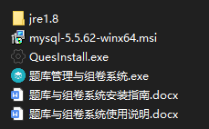
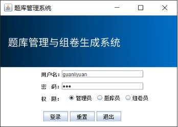
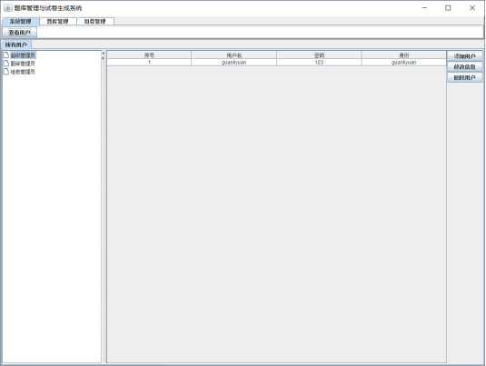
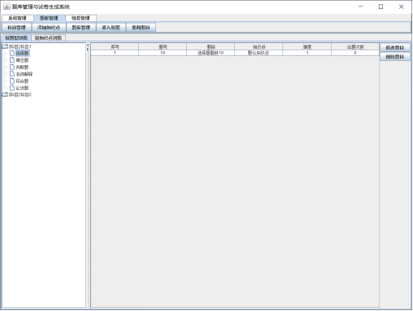
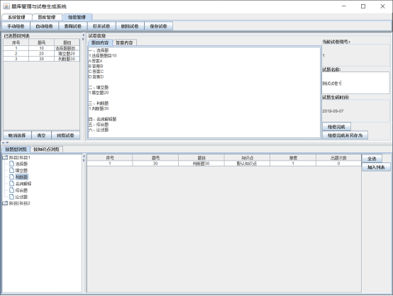
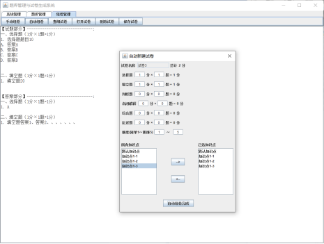

# 题库管理与组卷系统

根据老师需求，为公司的人事考核考试系统做的demo（现在看以前写的垃圾代码真是莫名其妙的羞耻hhhhh）

# 1. 项目介绍

本项目是用java+mysql+swing开发的题库管理与组件系统。包含用户管理、题库管理、手动组卷、自动组卷、试题管理等功能：

1. 用户管理
   * 用户登录与退出
   * 用户管理：包含添加/修改/删除用户
2. 题库管理
   * 科目管理：包含添加/修改/删除科目
   * 知识点管理：包含添加/删除知识点
   * 录入新题：选择科目和题型后录入新题
   * 浏览题目：按照知识点和提醒浏览
   * 题目管理：修改/删除题目
   * 查询题目: 支持按题型、题号、题目关键字、难度查询等
3. 组卷管理
   * 手动组卷：支持按题型/知识点浏览题目，将题目加入试卷，为试题命名后生成试卷。
   * 自动组卷：设置试卷信息后自动新建试卷
   * 保存试卷到本地：可以保存试卷+答案
   * 打开试卷：在面板上西安市试卷
   * 查询试卷：按试卷号、试卷名关键字查询等
   * 删除试卷

# 2. 仓库内容

| 文件夹      | 内容               | 备注                  |
| ----------- | ------------------ | --------------------- |
| QuesManager | 项目源代码         |                       |
| QuesSys     | 可以交付的生产版本 | 包含可用软件+描述文档 |

# 3. 如何使用该项目

1. 安装mysql（mysql-winx64.msi）
2. 运行安装程序（QuesInstall.exe）
3. 运行应用（题库管理与组卷系统.exe）

注：具体步骤在查看 安装指南文档。

# 4. 项目预览

